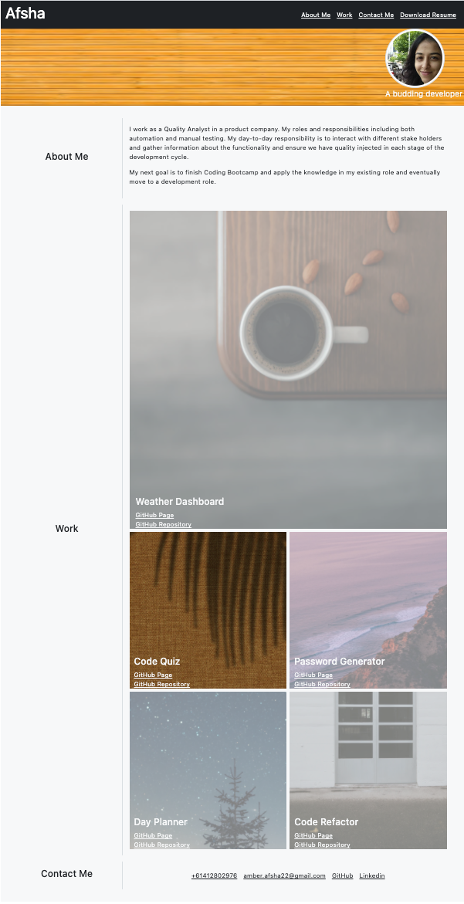

# Advanced CSS: Portfolio

## Website:

Link: https://afsha-22.github.io/advanced-css-portfolio/

The below mockup video shows the Advanced CSS Portfolio's appearance that has been created from scratch.

> **Note**: The above mockup image is not the true representation of the actual page. This layout contains responsive design for resolution with width 768px and 992px, so you may notice that some of the elements don't look like the mock-up at smaller resolution.

## Page Includes:

1. A header with navigation bar and a banner. Navigation links redirects to the respective page.
2. A main body including 3 sections: About Me, Work and Contact Me.
3. "About Me" contains a brief description of the candidate.
4. "Work" contains past experience about the candidate. When clicked on the work tile, it takes back to the top of the page.
5. "Contact Me" contains a navigation bar including different platforms to get in touch with the candidate. When clicked on the links, redirects to the respective platform in a new tab.

## Objective: To refactor the code and achieve following:

1.  The HTML elements are semantic
2.  The HTML element elements follow a logical structure independent of styling and positioning
3.  The image elements contains accessible alt attributes
4.  The heading attributes fall in sequential order
5.  The title element is concise and descriptive
6.  CSS selectors and properties are consolidated and organized to follow semantic structure
